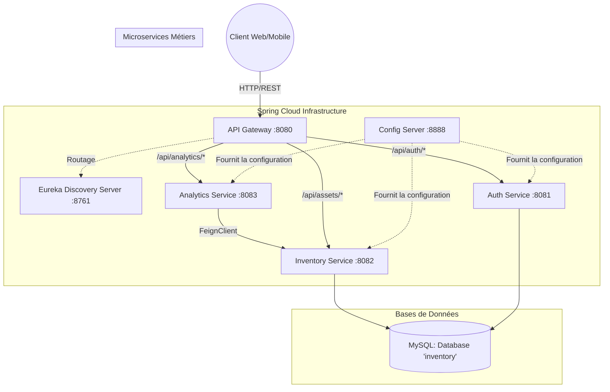

# Architecture du Système d'Inventaire (Microservices)

## Diagramme de Déploiement & Architecture globale

## Composants
1. **API Gateway** : Point d'entrée unique. Expose les routes `/api/auth`, `/api/assets`, `/api/maintenances`, `/api/analytics`.
2. **Eureka Discovery Server** : Gère le registre des microservices pour la résolution des noms (LB).
3. **Auth Service** : Gère les rôles (RBAC), les utilisateurs, et génère le JWT.
4. **Inventory Service** : Cœur métier (Équipements, Affectations, Tickets de maintenance, Historique).
5. **Analytics Service** : Module décisionnel (Maintenance prédictive heuristique) communicant via FeignClient.

