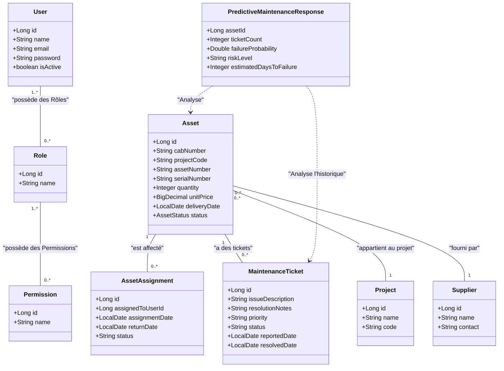

# Diagramme de Classes du Système d'Inventaire

Ce diagramme illustre les entités persistées sous MySQL dans le service d'authentification (`inventory_auth`) et d'inventaire (`inventory_assets`), ainsi que l'entité virtuelle d'analyse qui agglomère les informations via communication inter-microservices.

