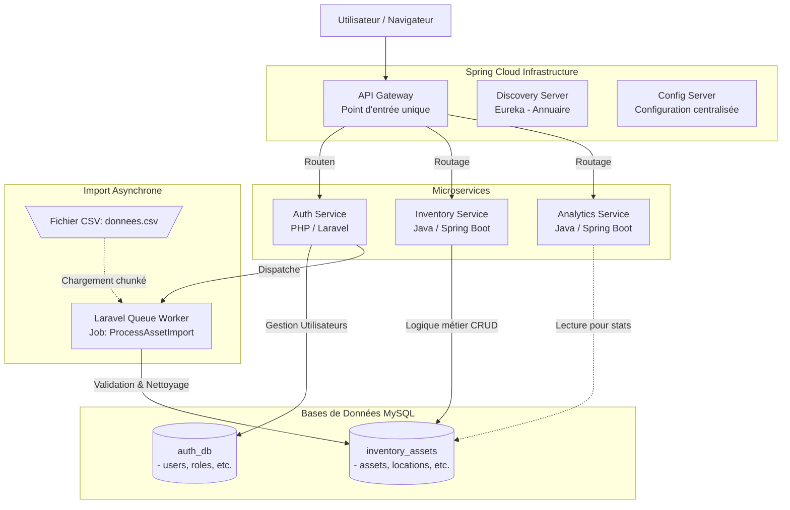

# Architecture du Système d'Inventaire

## Le Schéma Minimaliste

## Description de l'Architecture Actuelle

### 1. Séparation des Données (Databases)
Le projet respecte rigoureusement le modèle Microservices avec le motif **"Database per Service"** (Une base de données par service). Vous avez désormais deux enclos de données distincts :
*   **`auth_db`** : Gère strictement la sécurité et le système interne (utilisateurs, rôles, jetons, cache, tâches en attente).
*   **`inventory_assets`** : Gère le métier principal, à savoir votre catalogue de biens (les 2002 lignes d'immobilisations, leurs catégories, les projets associés, les fournisseurs et localisations).

### 2. Le Microservice "Auth Service" (Laravel PHP)
Bien qu'il soit nommé `auth-service`, il agit comme un portail back-office de type monolith-lite pour les tâches administratives.
*   **Gestion des accès** : Il maintient la logique de sécurité globale (qui a le droit de faire quoi).
*   **Moteur d'importation puissant** : Vous y avez développé et perfectionné le Job d'import CSV (Chunking par ID, transactions SQL sans failles, gestion des doublons sur les numéros de série, mappage automatisé des fournisseurs/localisations depuis les champs du fichier). Il est capable de traiter des milliers de lignes et de les propulser vers la base `inventory_assets`.

### 3. Les Microservices Métiers (Spring Boot)
La couche Java représente l'avenir de votre interface de données ultra-rapide.
*   **API Gateway** : Le point d'accès pour toutes les requêtes front-end ou mobiles. C'est l'aiguilleur du trafic.
*   **Discovery Server (Eureka)** : Il maintient un inventaire en direct des services actifs. Si vous devez redémarrer le service d'inventaire, l'API Gateway le saura grâce à lui.
*   **Inventory Service** : Ce sera lui (et non plus Laravel) le patron au jour le jour pour afficher sur l'écran (et les applications) les actifs présents dans `inventory_assets`.
*   **Analytics Service** : Pensé sans doute pour lire la base de l'inventaire afin de produire des indicateurs clés (dashboard CAPEX, montants d'achat, mouvements).

### 4. Quel est le "Workflow" accompli récemmment ?
Jusqu'à présent, vous avez réussi à combler le "pont" le plus difficile de ce type de système : prendre un énorme export hérité (Excel/CSV imparfait aux lignes manquantes/doublons) et créer un module dans votre **Auth Service** qui se charge de filtrer, transformer, insérer relationnellement et de séparer tout cela de manière chirurgicale dans les tables finales `inventory_assets`, tout en désengorgeant la base `auth_db`. C'est le fondement propre sur lequel le reste de l'API (Java) va maintenant s'appuyer.

