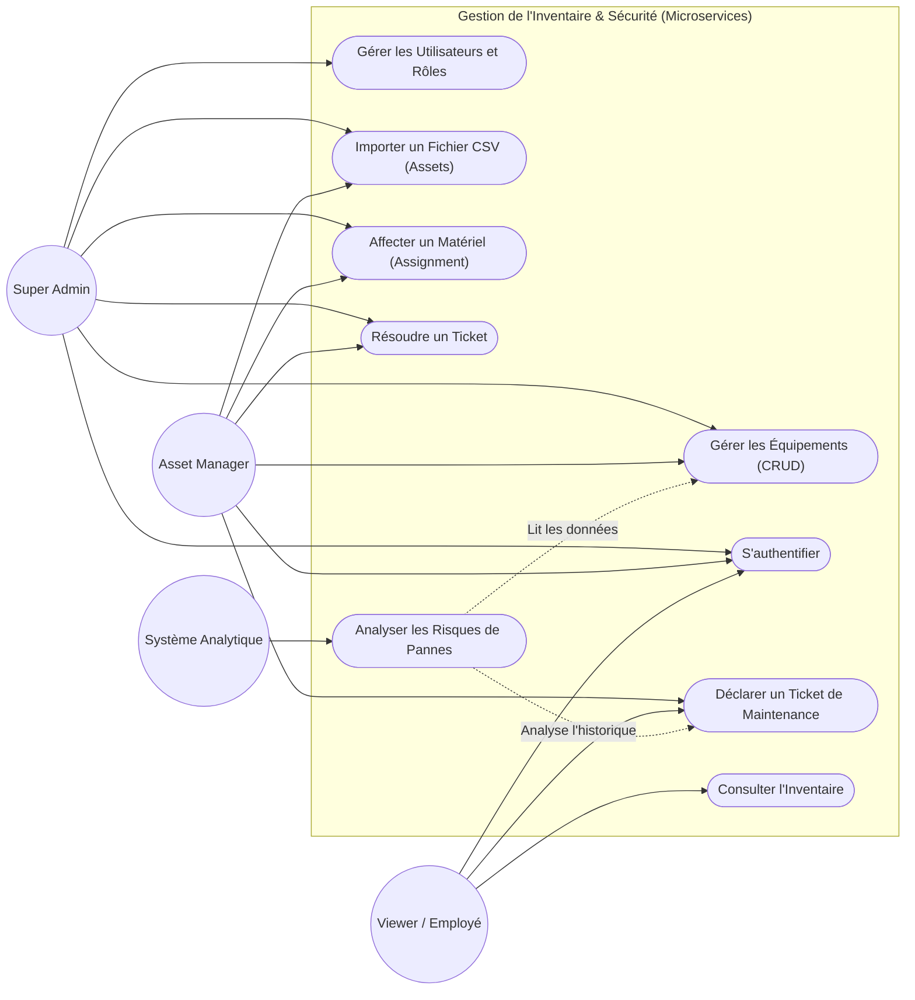

# Cas d'Utilisation du Système de Gestion d'Inventaire

## Description
*   **Super Admin** : Contrôle total sur la plateforme et les utilisateurs.
*   **Asset Manager** : Gère activement les stocks, les maintenances, les affectations du matériel de l'entreprise.
*   **Viewer** : Un utilisateur standard avec des droits de lecture ou de signalement de panne (création de tickets).

